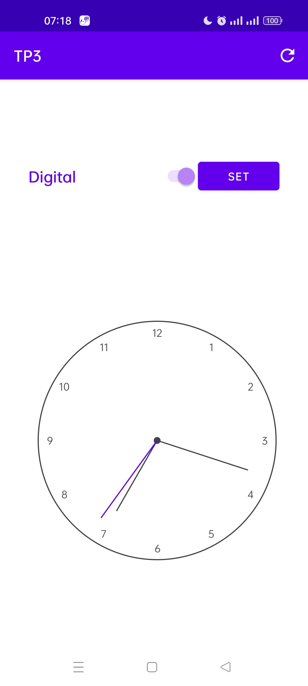

# ClockSwitch
This is a simple application where you can visualize either digital clock or analog clock
# Screenshots and Demo

<table align="center">
  <tr>
    <td>First Digital Clock</td>
     <td>Analog clock</td>
     <td colspan="2">Changing the button color </td>
  </tr>
  <tr>
    <td></td>
    <td></td>
    <td></td>
    <td></td>
  </tr>
 </table>
 
